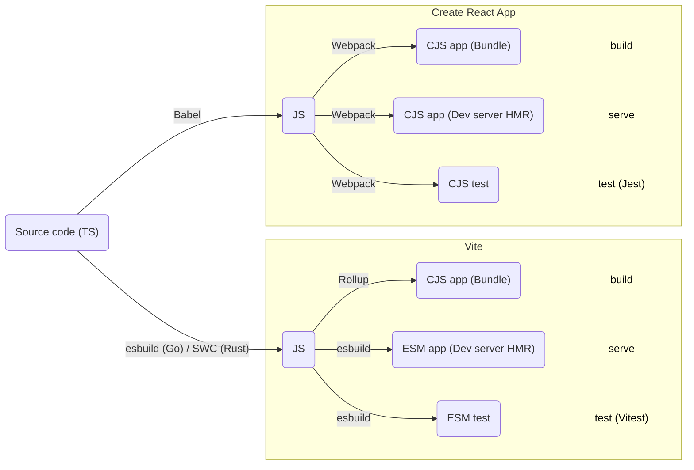
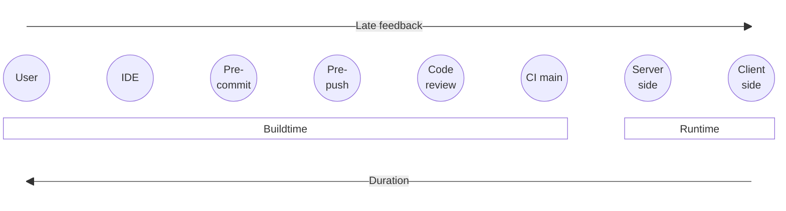
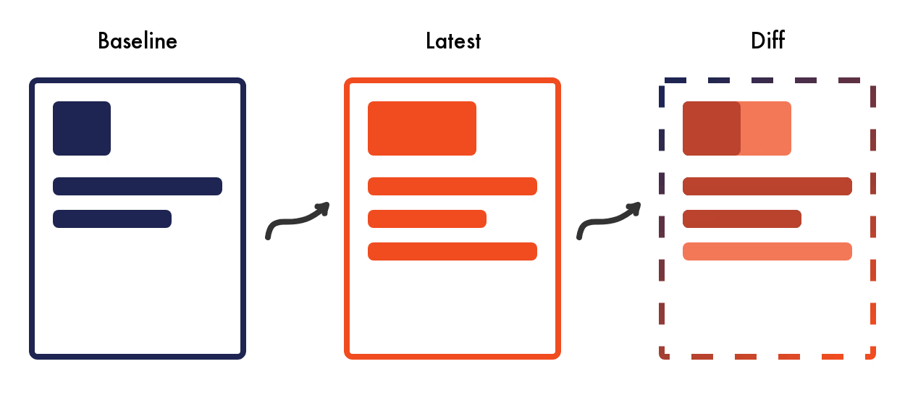
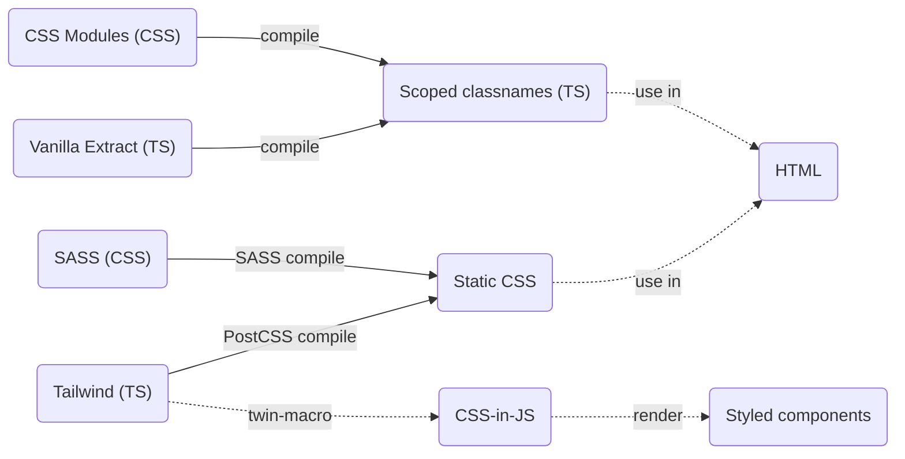

# Frontend training

Day 3

---
layout: toc
background: ./slidev-theme-xebia/public/pexels-junior-teixeira-2047905.jpg
---

# Table of contents

1. Setup new project (SPA)
2. Add a lot of tools including production deployment
3. Build Pokémon overview and detail page

<div class="mt-64 text-lg">
<code>git clone https://github.com/xebia/frontend-training.git</code>
</div>

---

# Building a Web App

<!-- Set to -translate-y-136 for correct PDF export -->

<div class="scale-80 -translate-y-32">

</div>

---

# Exercise: Scaffold project with Vite + React + TS

1. `npm create vite@latest` -> Project name **react-pokemon** and use **TypeScript** (no SWC)
2. Initialize Git repository:
    - `git init`
    - `git commit -a -m 'Initial commit'`
3. Cleanup!
    - Delete `assets`
    - Delete `public/vite.svg`
    - Delete `App.css`
    - Clear `index.css`
    - In `App.tsx`: `return <h1>Pokémon</h1>;`
    - In `index.html`: set meta title to 'Pokémon'
    - Commit

---

# Development lifecycle

Early feedback vs development performance (DX)



---

# Exercise: Git hooks and linting

1. `npm i -D husky`
2. `npx husky init`
3. Add `npm run lint` and `node_modules/.bin/tsc` to `.husky/pre-commit`

---

# Code styling (conventions)

- Makes it easier to read code because of familiar patterns
- Prevent useless distracting git diffs in commits and PRs
- It was part of `eslint` (and later `tslint`)
- Now done by `prettier` (Biome, JsFmt...)
- Sometimes breaks Golang templates are YML files

---

# Exercise: Prettier

1. `npm i -D prettier`
2. In `.prettierrc`:
    ```json
    {
      "arrowParens": "avoid",
      "printWidth": 120,
      "singleQuote": true,
      "trailingComma": "es5"
    }
    ```
3. `npx prettier . -w` and commit separately
4. Configure **Autoformat on save** in IDE
5. Try `'@typescript-eslint/indent': 'error'` in `eslintrc.cjs`. What happens?

---
layout: two-column
---
# Testing

::left::
- Test early (TDD if possible)
- Catch regression and document behavior
- Reveals code smells or bad design (code is hard to test)

::right::

<span class="text-gray text-xs">Source: kentcdodds.com</span>

---

# Start testing existing codebase

1. Test new code
2. Test code you touch (boy scout rule)
3. Test other code, starting with highest risk

---

# Test tools


|             | Runner | Framework | Assertions |
| ----------- | ------ |-----------|------------|
| Karma 🐢    | ✅ CJS |           |            |
| Jasmine     |        | ✅        | ✅         |
| Mocha 🐢    | ✅ CJS | ✅        |            |
| Chai        |        |           | ✅         |
| Jest 🚲     | ✅ CJS | ✅        |            |
| **Vitest** ⚡️| ✅ ESM | ✅        | ✅         |

For even more ⚡️ and great DX use [WallabyJS](https://wallabyjs.com/) IDE extension

---

# Exercise: Vitest

1. `npm i -D vitest`
2. Add npm script `"test": "vitest"` in `package.json`
3. Create a dummy test that asserts 1+1=2 in `App.spec.tsx`
4. Install Vitest VSCode extension to run tests from you spec files

---

# Exercise: Component tests

1. `npm i -D @testing-library/{react,jest-dom,user-event,jsdom}`
2. Configure vitest in `vite.config.ts`:
    ```ts
    /// <reference types="vitest" />
    ```
    ```ts
    test: {
      environment: 'jsdom',
      globals: true,
      setupFiles: ['./vitest-setup.ts'],
    },
    ```
3. Create `vitest-setup.ts` with `import '@testing-library/jest-dom/vitest';`
4. Implement real test in `App.spec.tsx`
5. Add `npm test run` to `.husky/pre-push`

---

# Test coverage

- <span class="text-green-700 font-bold">100% coverage</span> is for OCD people and managers
- Coverage doesn't say anything about whether something is tested (asserted)
- Opposite is true: no coverage means it is not tested
- Find balance between effort and confidence 👌

---

# Exercise: Test coverage

1. `npm i -D @vitest/coverage-v8`
2. Add `coverage` config to `vite.config.ts`
3. Update `pre-push` to `npm test run -- --coverage`

In existing projects: raise coverage threshold every PR (or automate using `coverage.thresholds.autoUpdate`)

---

# End to end (browser) testing

- E2E usually means the full frontend (pages)
- Prematurely happy flow like a smoke test
- APIs are either
    - Mocked (cheap, simple, static)
    - Real but single isolated seeded environment (expensive, complex, dynamic)
- IDP (auth) is also an API, so mock it if possible, else automate login flow

---

# Exercise: Playwright

1. `npm init playwright@latest`
2. `npx playwright install`
3. Clean up `playwright.config.ts`: only Desktop Chrome, `npm run dev` as web server
4. Update vitest include pattern not to include E2E spec files
5. Add E2E test that asserts
    ```ts
    expect(await page.getByRole('heading', { level: 1, name: 'Pokémon' })).toBeVisible();
    ```

---

# Storybook

Develop components in isolation
- Better components
- Better DX
- Document your components (style guide / component library)
---

# Exercise: Storybook

1. `npx storybook@latest init`
2. Clear all stories
3. Create `App.stories.tsx` ([Example](https://storybook.js.org/docs/get-started/whats-a-story)) with `meta: { tags: ['autodocs'] }`
4. Update vitest to exclude stories for coverage

---

# Why a CI pipeline?

- The times that you FTP a php file and refresh the production webpage to get feedback...
- Catch regression, keep `main` stable
- Do it **now**, not when ready to release to customers
- Release vs deploy 

---

# Exercise: CI pipeline

1. Create `.circleci/config.yml` (add to `.prettierignore`)
2. https://gist.github.com/fvanwijk/0c4baaa475924f84980dd3594733acb8
3. Commit and push
4. Log in to CircleCI with GitHub account and setup new project

---

# Deploy targets

- CDN / Blob storage / S3 for client only apps (SPA, static)
- Docker (+k8s?) or specialized cloud hosting for apps that need a server

---

# Exercise: Deploy on Netlify

1. `npm i -D netlify-cli` (also with `-g`)
2. `netlify login`
3. `netlify --telemetry-disable`
4. `netlify sites:create`
5. Add the `NETLIFY_AUTH_TOKEN` and `NETLIFY_SITE_ID` to CircleCI
6. Extend pipeline with Netlify build and deploy steps

---

# Data fetching
## Better title: *Keep server state and client state in sync*

- When to fetch?
    - Component `useEffect`
    - Route loader
    - Stale / invalidated / window refocus
- Mutate = fetch with payload after user action

---

# Exercise: React Query

1. `npm i -S @tanstack/react-query`
2. Add `<QueryProvider>` to `main.tsx`, `preview.tsx` decorator and `TestQueryClientProvider` to `testUtils.tsx`
3. In `App.tsx` fetch and render a list of [pokemon](https://pokeapi.co)
4. Update tests

---

# API mocking

- When real API is not ready yet
- To have control over responses (eg. error flow)
- To test mutations (POST/PUT/PATCH/DELETE)
- For dev server, unit/component/E2E tests and Storybook

---

# API mocking

What exactly to mock?

<v-clicks>

- Service / util that calls `fetch`? Mock the ES module 👎
- `fetch`? Mock using 'polyfill' 👎
- HTTP layer in browser / Node? Mock using service worker 👍

</v-clicks>

---

# Exercise: Mocking with MSW

1. `npm i -D {msw,msw-storybook-addon@beta}`
2. Integrate into app (`browser`), tests (`server`) and Storybook (addon)
3. Render ERROR test in `App.spec.tsx` when fetching fails

---

# Visual regression testing

Tests in the *testing trophy* only test **JS** and **HTML**.
How to test **CSS**?

<v-click>

I mean, not the styles and classnames but what you **SEE** 👁️



</v-click>

---

# Exercise: Visual regression testing with Chromatic

1. `npm i -D chromatic`
2. Add job to pipeline: `npx chromatic --project-token=$CHROMATIC_PROJECT_TOKEN --exit-zero-on-changes`
3. Add `CHROMATIC_PROJECT_TOKEN` to env vars in CircleCI
4. Configure Chromatic: Disable UI review

---

# Router

- Render (parts of) pages based on path
- Lazy loading
- Route guards (auth)
- Separate data fetching from rendering

---

# Exercise: React Router

1. Rename `App.tsx` to `list/List.tsx` (also stories and specs)
2. Add Router to `main.tsx` that renders `<List />` on `/`
3. Add Router to Storybook:
    - Add `'storybook-addon-react-router-v6'` addon in `.storybook/main.tsx`
    - Import and add decorator: `import { withRouter } from 'storybook-addon-react-router-v6';` in `.storybook/preview.tsx`
4. Add `Detail` component for route `/pokemon/:id` that renders Pokemon name, ID and image
5. Extend E2E tests

---

# Refactoring

- Cut code and paste into new file for reuse in multiple places?
- What is the *right* abstraction?
- Code changes but no functional change (tests should pass without changing them)
- Creating child components; pros and cons
- Clear responsibility of component/function/class

---

# Exercise: Refactoring

- Refactor `fetch` into reusable `fetchInstance`
- Refactor `useQuery` into reusable `usePokemonList` and `usePokemon`

---

# Styling

<span class="absolute top-28 text-xs">CSS Custom properties can always be used and are applied run-time</span>




---

# Exercise: Styling with Typescript

1. `npm i -D @vanilla-extract/vite-plugin`
2. Load Lato font via `index.html`/`preview-head.html`  (See fonts.google.com)
3. Style app globally and scoped

---

# What are we testing in the E2E test?

- End to end *front-end* test

<div v-click-hide className="relative -top-4">

- Development server

</div>

<div v-after class="relative -top-15.25">

- ~~Development server~~
- Should be "what runs on production"
    - Optimized bundle
    - Statically served

</div>

---

# Exercise: E2E testing against production build

1. Add step to E2E job in pipeline: `NODE_ENV=development npm run build`
2. Change Playwright `webServer` into `npm run preview` (port is also updated to 4173)

---
layout: thank-you-dark
background: ./slidev-theme-xebia/public/pexels-lex-photography-1109543.jpg
---

# That's all folks!

Please fill in the feedback form